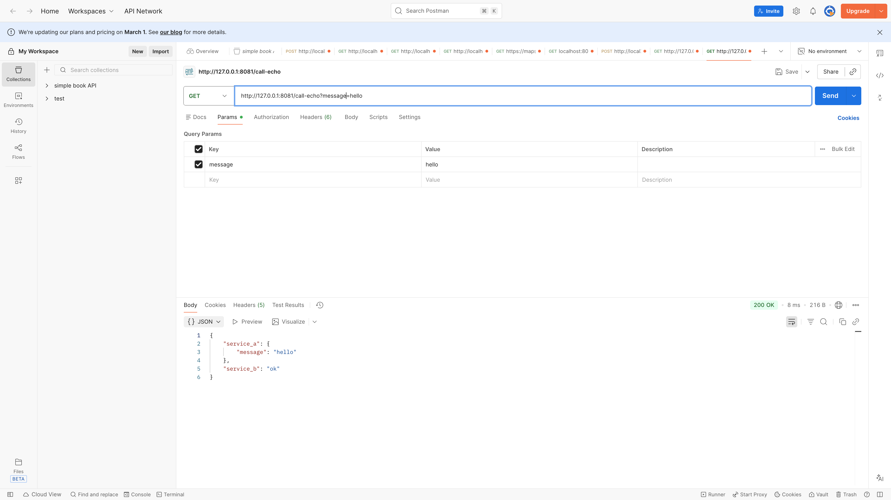
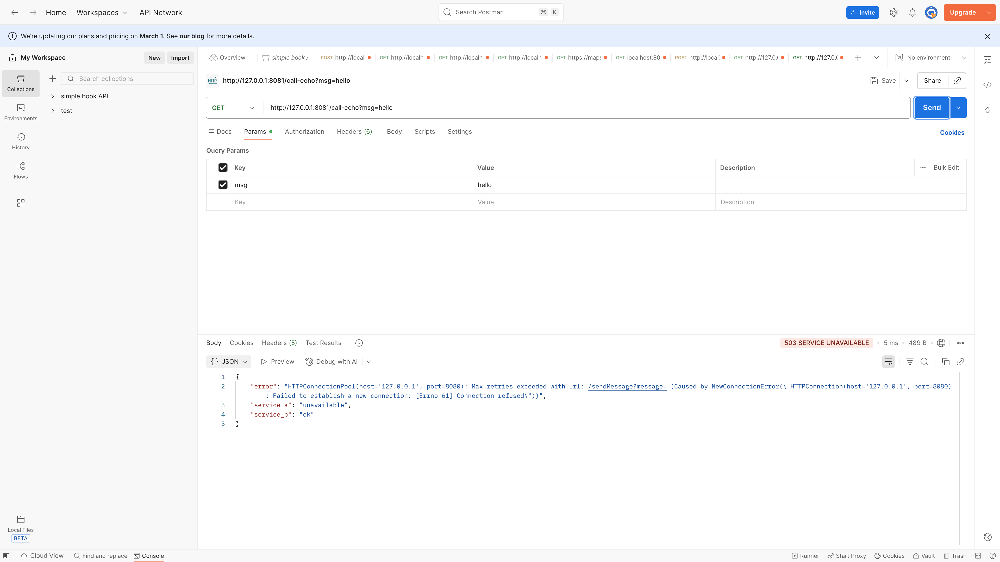

# Lab 1: Service A (Provider) & Service B (Consumer)

## How to run locally

**Recommended:** use a virtual environment so dependencies stay isolated from your system Python.

From the repo root, create and activate a venv, then install dependencies once:

```bash
python3 -m venv venv
source venv/bin/activate   # Windows: venv\Scripts\activate
pip install -r service-a/requirements.txt
pip install -r service-b/requirements.txt
```

Run each service in a **separate terminal** (activate the venv in each: `source venv/bin/activate` from the repo root).

1. **Terminal 1 — Service A (provider, port 8080)**
   ```bash
   cd service-a
   python app.py
   ```
   Leave this running. You should see the app listening on `http://127.0.0.1:8080`.

2. **Terminal 2 — Service B (consumer, port 8081)**
   ```bash
   cd service-b
   python app.py
   ```
   Leave this running. You should see the app listening on `http://127.0.0.1:8081`.

---

## Success + failure proof

### Success (both services running)

Use **Postman** to call the consumer; it forwards to the provider and returns a combined response.

- **Method:** GET  
- **URL:** `http://127.0.0.1:8081/call-echo`  
- **Params (optional):** add query key `message` with value `hello` (or leave empty for default)

**Example response (200):**
```json
{"service_a":{"message":"hello"},"service_b":"ok"}
```

With no `message` param, the provider’s default is used:
```json
{"service_a":{"message":"hello world from service A"},"service_b":"ok"}
```

### Failure (provider down)

1. Stop Service A (Ctrl+C in Terminal 1).
2. In Postman: same request — **GET** `http://127.0.0.1:8081/call-echo` (optional: `message` = `hello`). Send.
3. **Expected:** HTTP 503 and response body with `service_b`, `service_a`, and `error`. The `error` field contains the real exception message (e.g. connection refused when the provider is down):
   ```json
   {
       "error": "HTTPConnectionPool(host='127.0.0.1', port=8080): Max retries exceeded with url: /sendMessage?message= (Caused by NewConnectionError(\"HTTPConnection(host='127.0.0.1', port=8080): Failed to establish a new connection: [Errno 61] Connection refused\"))",
       "service_a": "unavailable",
       "service_b": "ok"
   }
   ```
4. Service B’s terminal logs an error (e.g. `status=error`, connection refused or timeout). Restart Service A to continue testing.

### Screenshots

**Success:** Consumer returns 200 with combined response (both services running).



**Failure:** Consumer returns 503 when Service A is stopped; Service B logs the error.



---

## What makes this distributed?

This is distributed because **Service B and Service A are separate processes** that communicate only over the network. Service B does not import or run Service A’s code; it sends HTTP requests to `http://127.0.0.1:8080` and handles timeouts and failures (e.g. returning 503 when the provider is down). Work is split across two independent services, with the consumer depending on the provider’s availability and response.
